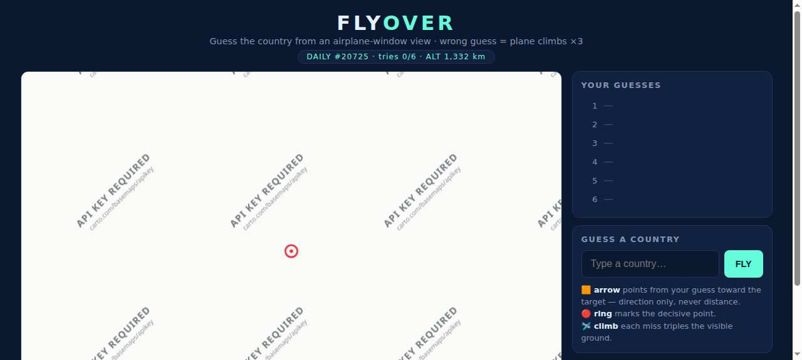

# 🛩️ Flyover

Daily geography game: **guess the country from an airplane-window view.**
Inspired by [FlightQ's Flyover](https://flightq.app/flyover) — rebuilt from scratch as a dependency-free, server-less single page.



## How to play

1. Open `index.html` in any browser (works offline).
2. You see an **unlabeled map patch** — coastlines, rivers, borders only. The red ring marks the decisive point.
3. Type a country and hit **FLY**. Aliases work: `USA`, `UK`, `Burma`, `Czechia`, `Holland`…
4. Every miss:
   - the plane **climbs** — each view shows much more ground (12° → 36° → 100° → 220° → 320° → whole planet)
   - a **compass arrow** appears pointing from your guess toward the target — direction only, never distance
5. You have **6 views**. Solved faster = better.

## Competing with friends

- Everyone in the world gets the **same country each day** (deterministic hash of the UTC date — no server needed).
- On game over, hit **Copy result** and paste the emoji grid into your group chat:

  ```
  🛩️ Flyover #20725 — 3/6
  ⬜⬜🟩⬜⬜⬜
  Can you name the country from the window view?
  ```

- Beaten the daily? **🎲 Free play** gives unlimited rounds with random countries.

## Tech

| | |
|---|---|
| Stack | Vanilla HTML/CSS/JS, single page, zero dependencies |
| Geometry | Natural Earth country polygons (178 countries), Douglas-Peucker simplified to ~120 KB — used as offline fallback layer |
| Basemap | **OpenStreetMap raster tiles** (CARTO no-labels style) — full detail: coastline, rivers, terrain, roads, urban areas. Labels stripped so it stays a game |
| Daily pick | `hash(UTC day) % pool` — same worldwide, no backend |
| Pool | 138 playable countries (real landmasses only — no micro-island lotteries) |
| Renderer | Canvas 2D, Web Mercator, 256 px tiles with caching + view culling |
| Zoom ladder | 12° → 36° → 100° → 220° → 320° → 360° of longitude per view |

## Run

No build, no install:

```bash
git clone https://github.com/ebarczynski/flyover.git
open flyover/index.html   # or just double-click it
```

## License

MIT
